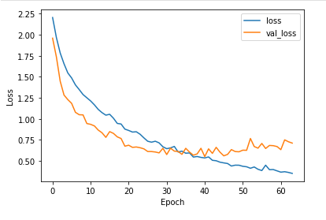
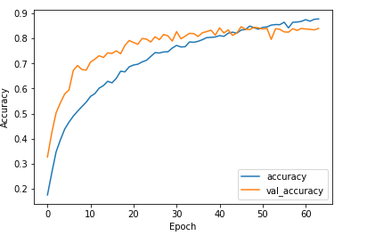

# Global AI Hub Koç Holding Derin Öğrenme Bootcamp Proje Çalışması 37. Grup Pioneers

Bu proje esnasında amacımız bize sunulan dataset üzerinde eğitilip denenerek oluşturulmuş şehir seslerini tanıyabilen bir derin öğrenme modeli oluşturmak.

Proje için ilk olarak ön işleme notebook'u ile dataseti sınıflandırdım. Bu sınıflandırma 10 ayrı daldaki seslerin her birini arkaplan ve önden gelen sesler olarak ayırma ile yapıldı. Bunun üzerine her bir sesi spektrogram haline çevirdim. (Ön İşleme: Fırat Çetin)

Tüm spektrogram verileri proje dosyları arasındaki Processed_Data klasöründe links.md dosyasında ve burada aşağıda belirttiğim Google Drive klasörüne yüklendi. 

Derin öğrenme modelinde kullanmak üzere veri dosyalarını openCV ile işledim ve numpy arraylere dönüştürdüm. Bu arrayleri ise drive'ımda image_arrays adlı klasörün altına txt dosyası olarak kaydettim ve ardından labels.txt adlı dosya ile labelları da kaydettim. Tüm gerekli dosyalara bu klasör altından ulaşılabilir:
[image_arrays](https://drive.google.com/drive/folders/1ufpKinzW_au2sp76naLs_NpVRczKFMnN?usp=sharing)

Projenin bir kısmında spektrogram boyutlarının ve bunları arraylere çevirinceki boyutların çok fazla olmasından kaynaklı spektrogramları çok daha küçük kopyaları ile değiştirdim.

Tüm proje 4.10.2022 tarihinde sonlandı. Modelin son istatistikleri:
#### Epoch vs Loss:

#### Epoch vs Accuracy:

#### Test Results:
    Loss: 0.672789990901947
    Accuracy:0.8501144051551819

Bu Veri seti [Urban Sound](https://urbansounddataset.weebly.com/urbansound8k.html) üzerinden alınmıştır ve linkte kaynak belirtilmiştir. 

This dataset has been gathered from [Urban Sound](https://urbansounddataset.weebly.com/urbansound8k.html) and we mentioned the source link. All copyrights claimed by Urban Sound.

# Fırat Çetin
[LinkedIn](https://www.linkedin.com/in/f%C4%B1ratcetin1/)
[Instagram](https://www.instagram.com/bilgisayargibi/?hl=tr)
[GitHUB](https://github.com/firatctin)
